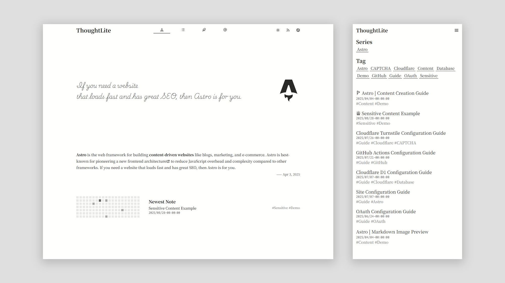
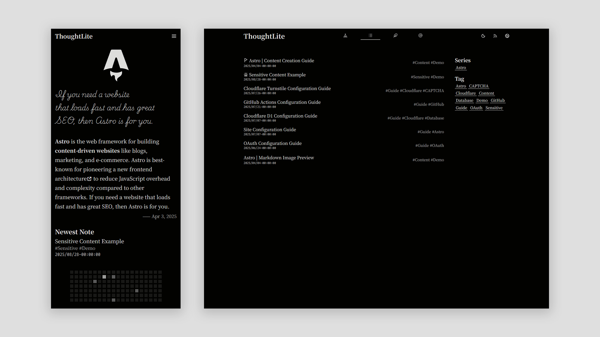

# ThoughtLite

<div align="center">
    <p>
        
        
    </p>
    <p>
        <a href="https://github.com/tuyuritio/astro-theme-thought-lite/releases/latest"></a>
        <a href="https://raw.githubusercontent.com/tuyuritio/astro-theme-thought-lite/refs/heads/main/LICENSE"></a>
    </p>
    <p>コンテンツ作成に特化し、モダンな <a href="https://astro.build/">Astro</a> テーマ 🌟</p>
    <p>
        <small><a href="README.md">English</a></small>
        <small><a href="README.zh-cn.md">简体中文</a></small>
        <small><ins>日本語</ins></small>
    </p>
</div>

> [!NOTE]
> - `main` ブランチ✅：静的ビルド、任意の静的ホスティングプラットフォームにデプロイ可能。
> - `cloudflare` ブランチ：内蔵コメントシステムを有効にし、Cloudflare のみでデプロイ可能。

🎬 **ライブデモ**：[Vercel](https://thought-lite.vercel.app/ja/)

## ✨ 機能

- [x] **レスポンシブデザイン** - モバイル、タブレット、デスクトップに対応。
- [x] **ライト / ダークモード** - システムに自動追従し、手動切り替えもサポート。
- [x] **CSR 動的コンテンツフィルタリング** - History API によるリストフィルタリングとページネーション。
- [x] **i18n サポート** - 拡張可能な多言語対応、単一言語モードでも完璧に動作。
- [x] **サイトマップ & フィード購読** - サイトマップと Atom フィードの自動生成。
- [x] **OpenGraph サポート** - 組み込みの Open Graph メタタグでソーシャルメディア共有を最適化。

## ⚡️ クイックスタート

### Astro コマンドを使用

以下のコマンドを実行します：

```sh
pnpm create astro --template tuyuritio/astro-theme-thought-lite

# 対話型プロンプトに従ってプロジェクトを作成

cd <your-project-name>
pnpm dev
```

### テンプレートを使用

1. [このテンプレートを使用して](https://github.com/new?template_name=astro-theme-thought-lite&template_owner=tuyuritio)新しいリポジトリを作成するか、このリポジトリを [Fork](https://github.com/tuyuritio/astro-theme-thought-lite/fork) します。
2. 以下のコマンドを実行します：

```sh
git clone <your-repo-url>
cd <your-repo-name>
pnpm install
pnpm dev
```

## 🔧 設定

サイト設定および国際化（i18n）設定をカスタマイズするには、以下のファイルを変更してください：

- `.env`
- `astro.config.ts`
- `site.config.ts`

基本設定については[サイト設定ガイド](src/content/note/ja/configuration.md)を参照してください。

国際化設定については[国際化設定ガイド](src/content/note/ja/internationalization.md)を参照してください。

## 💻 コマンド

テーマは以下の一般的なコマンドを提供します：

| コマンド | アクション |
| --- | --- |
| `pnpm install` | プロジェクトの依存関係をインストール |
| `pnpm update` | プロジェクトの依存関係を更新 |
| `pnpm new` | 新しいコンテンツファイルを作成 |
| `pnpm dev` | ローカル開発サーバーを起動（デフォルト：`http://localhost:4321`） |
| `pnpm check` | Astro 型チェックを実行 |
| `pnpm build` | 本番バージョンをビルド |
| `pnpm preview` | ビルドしたサイトをプレビュー |
| `pnpm format` | コードフォーマット |
| `pnpm lint` | コードリント |

## 🚀 デプロイ

現在のブランチは完全に静的ビルドが可能で、任意の静的ホスティングプラットフォームにデプロイできます。

各プラットフォームのデプロイ方法については、[Astro 公式デプロイガイド](https://docs.astro.build/ja/guides/deploy/)を参照してください。

[](https://vercel.com/new/clone?repository-url=https://github.com/tuyuritio/astro-theme-thought-lite&project-name=astro-blog-thought-lite&repository-name=astro-blog-thought-lite&teamSlug=tuyuritios-projects)
[](https://app.netlify.com/integration/start/deploy?repository=https://github.com/tuyuritio/astro-theme-thought-lite)

## 🔄 更新

アップストリームの更新を同期するには、以下のコマンドを実行します：

```sh
git remote add theme https://github.com/tuyuritio/astro-theme-thought-lite.git
git fetch theme
git merge theme/main    # 初回更新時は `--allow-unrelated-histories` フラグを追加
pnpm install
```

## ✍️ コンテンツ作成

コンテンツ作成は `src/content` ディレクトリに集中しており、主に以下の部分を含みます：

- `note` - 文記、入念に構成された詳細な長文作品に特化
- `jotting` - 随筆、軽量で即時的なコンテンツ記録
- `preface` - 序文、第一印象としてサイトのホームページに表示
- `information` - 情報、各種説明的なコンテンツを含む

詳細は[コンテンツ作成ガイド](src/content/note/ja/content.md)を参照してください。

## 🤝 貢献

あらゆる形式の貢献を歓迎し、感謝しています！

- プロジェクトの宣伝や他のユーザーの支援
- [Issues](https://github.com/tuyuritio/astro-theme-thought-lite/issues) の報告や新機能の提案
- ドキュメントの改善や国際化（i18n）の支援
- コード貢献の提出 - 詳細は[コード貢献ガイド](CONTRIBUTING.md)を参照してください

## 🙏 謝辞

### 技術スタック

- **コアフレームワーク** - [Astro](https://astro.build/)
- **コア言語** - [TypeScript](https://www.typescriptlang.org/)
- **UI コンポーネント** - [Svelte](https://svelte.dev/)
- **CSS エンジン** - [UnoCSS](https://unocss.dev/)
- **CSS プリプロセッサ** - [Less](https://lesscss.org/)
- **アイコン** - [Iconify](https://iconify.design/)
- **フォント** - [Google Fonts](https://fonts.google.com/) | [ZeoSeven Fonts](https://fonts.zeoseven.com/)
- **画像ビューア** - [Medium Zoom](https://github.com/francoischalifour/medium-zoom)
- **SPA トランジション** - [Swup](https://swup.js.org/)
- **時間処理** - [Luxon](https://moment.github.io/luxon/)
- **コード品質** - [Biome](https://biomejs.dev/)
- **静的デプロイ** - [Vercel](https://vercel.com/)

### インスピレーション

- [Astro Sphere](https://github.com/markhorn-dev/astro-sphere)
- [astro-vitesse](https://github.com/adrian-ub/astro-vitesse)
- [Miniblog](https://github.com/nicholasdly/miniblog)
- [AstroPaper with I18n](https://github.com/yousef8/astro-paper-i18n)

## 📜 ライセンス

このプロジェクトは [GPLv3](LICENSE) でライセンスされており、自由に変更および配布できますが、元の著作権表示を保持する必要があります。
